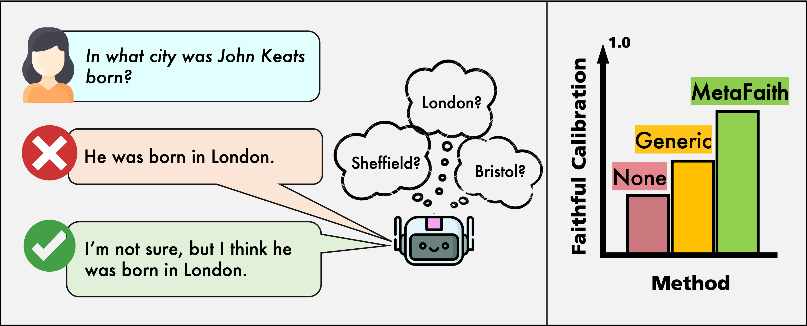
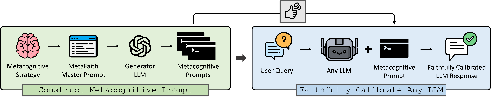

# MetaFaith: Faithful Natural Language Uncertainty Expression in LLMs


This repository provides code for the first study to systematically and comprehensively benchmark **faithful confidence calibration** of LLMs, evaluating models’ ability to use linguistic expressions of uncertainty that *faithfully reflect* their intrinsic uncertainty, across diverse models, datasets, and prompting strategies. 

It also includes the implementation of **MetaFaith**, a systematic procedure to construct metacognition-inspired calibration prompts that can automatically align intrinsic and expressed uncertainty of LLMs. MetaFaith substantially improves faithful calibration of instruction-following LLMs in a task-agnostic manner. It requires no prompt tuning and generalizes robustly across models, tasks, and content domains.

<!--  -->
<!-- <p align="center">
    
</p> -->

<p align="center">
    <a href="http://arxiv.org/abs/2505.24858" style="display:inline-block;background-color:#2196F3;color:white;padding:10px 20px;text-align:center;text-decoration:none;font-size:20px;border-radius:5px;">📄 <b>Paper</b></a>
</p>

## Quick Links

- [🛠 Installation](#installation)
- [📂 File Structure](#structure)
- [📊 Benchmarking Experiments](#benchmarking)
- [🗂 MetaFaith](#metafaith)
- [📝 Citation](#citation)

<a name="installation"></a> 

## 🛠 Installation

1. **Clone the Repository**
    ```bash
    git clone https://github.com/yale-nlp/MetaFaith.git
    cd MetaFaith
    ```
2. **Create Conda Environment & Install Dependencies**
    ```bash
    conda create --name metafaith_env python=3.11
    conda activate metafaith_env
    pip install -r reqs.txt
    ```
3. **Configure Environment Variables**\
    Create a .env file (or set these in your shell) with the following keys:
    * `OPENAI_API_KEY`: To access GPT models
    * `GEMINI_API_KEY`: To access Gemini models
    * `HF_TOKEN`: To access HuggingFace models

4. **Dataset Download**\
    Download the UMWP dataset [here](https://github.com/Yuki-Asuuna/UMWP/blob/main/data/StandardDataset.jsonl), rename the file to `umwp.jsonl`, and place it in the `src/data` directory.

<a name="structure"></a> 

## 📂 File Structure

- `demos/`: Demonstration of the MetaFaith master prompt, MetaFaith metacognitive strategies, and MetaFaith calibration prompts.
- `src/`: Core evaluation code.
  - `data/`: Directory to store local data files for datasets not hosted on HuggingFace.
    - `umwp.jsonl`: Data file for the UMWP dataset, obtained and renamed per the [Installation directions](#installation).
  - `metrics/`: Implementation of metrics to quantify faithful calibration.
    - `assertions.py`: Code to extract atomic assertions from model responses.
    - `decisiveness.py`: Code to quantify decisiveness of model assertions.
    - `uncertainty.py`: Code to quantify models' intrinsic confidence in assertions.
    - `faithfulness.py`: Code to score instance-level faithful calibration for a single sample.
    - `faithfulness_batch.py`: Code to score instance-level faithful calibration for a batch of samples.
  - `tasks/`: Module to prepare datasets/tasks for evaluation.
    - `__init__.py`: Registry of all datasets/tasks used in experiments.
    - `_task.py`: Abstract class for task definitions.
    - `_template.py`: Template for concrete class instantiations.
    - `qa.py`: Class to handle all tasks used in experiments.
    - `add_new_task.md`: Instructions for how to seamlessly add new datasets and task types to the evaluation framework.
  - `prompts/`: Prompts used for LLM evaluations.
    - `__init__.py`: Registry of all uncertainty elicitation prompts and task prompts.
    - `input_prompts.py`: String formatting for instance-level inputs.
    - `task_prompts.py`: String formatting for different task types. Used jointly with input prompts.
    - `hedge_prompts.py`: Baseline uncertainty elicitation prompts.
    - `advanced_prompts.py`: Advanced prompt strategies for uncertainty elicitation.
    - `metafaith_calibration_prompts.py`: MetaFaith calibration prompts to faithfully calibrate LLMs.
    - `scoring_prompts.py`: Prompts used for LLM-as-a-Judge-based assertion extraction and evaluation of decisiveness, consistency across sampled responses, and task accuracy.
  - `scripts/`: Code for inference and scoring.
    - `run_single_proprietary.py`: Run inference on all datasets for a single model and hedge prompt. For models accessed via the OpenAI API or Gemini API.
    - `run_single_vllm.py`: Run inference on all datasets for a single model and hedge prompt. For models accessed via HuggingFace with VLLM.
    - `score_single_proprietary.py`: Score faithfulness on all datasets for a single model and hedge prompt. For models accessed via the OpenAI API or Gemini API.
    - `score_single_vllm.py`: Score faithfulness on all datasets for a single model and hedge prompt. For models accessed via HuggingFace with VLLM.
    - `score_cmd_proprietary.py`: Script to construct and run the scoring command for a single model x dataset x prompt combination. Called by `score_single_proprietary.py`.
    - `score_cmd_vllm.py`: Script to construct and run the scoring command for a single model x dataset x prompt combination. Called by `score_single_vllm.py`.
  - `utilities/`: Code for 
    - `utils.py`: Utility functions.
- `results/`: Default directory to store inference and scoring results; created automatically.
- `run_exp_proprietary.py`: Main run script for proprietary model inference experiments. Called by `run_single_proprietary.sh`.
- `run_exp_vllm.py`: Main run script for open-source model inference experiments. Called by `run_single_vllm.sh`.
- `score_exp_proprietary.py`: Main run script for proprietary model inference experiments. Called by `score_cmd_proprietary.sh`.
- `score_exp_vllm.py`: Main run script for open-source model inference experiments. Called by `score_cmd_vllm.sh`.
- `reqs.txt`: Dependencies for environment creation.


<a name="benchmarking"></a> 

## 📊 Benchmarking Experiments

To benchmark faithful calibration on all datasets for a specific model with a simple uncertainty elicitation prompt, run inference and scoring commands as follows. Here, we use the `basic` uncertainty elicitation prompt on three different types of models. The full list of elicitation ("hedge") prompt options is specified in [`src/prompts/__init__.py`](https://github.com/yale-nlp/MetaFaith/blob/main/src/prompts/__init__.py). Note that you may need to set the `CUDA_VISIBLE_DEVICES` variable before launching experiments to use the correct GPU(s). 

```bash
# Set up environment
export PYTHONPATH=.; cd src

# ------------------------------------
# ✍️ Baseline Prompting Strategies
# ------------------------------------

# Run inference using the `basic` uncertainty eliciation prompt
bash ./scripts/run_single_vllm.sh Qwen/Qwen2.5-1.5B-Instruct basic 0.9 1  # HF model
bash ./scripts/run_single_proprietary.sh gemini-2.0-flash basic           # Gemini model
bash ./scripts/run_single_proprietary.sh gpt-4o-mini basic                # GPT model

# Note: For VLLM runs, GPU memory utilization and tensor parallel size can be specified. Example above uses GMU = 0.9 and TPS = 1.
# VLLM model names are identical to HuggingFace model names. Proprietary model names are identical to those used in their respective APIs.
# Results will be automatically stored in the ./results directory. 
# An aptly named subdirectory will be automatically created in ./results for each experimental setting.

# Run scoring to quantify faithful calibration
bash ./scripts/score_single_vllm.sh Qwen/Qwen2.5-1.5B-Instruct basic      # HF model
bash ./scripts/score_single_proprietary.sh gemini-2.0-flash basic         # Gemini model
bash ./scripts/score_single_proprietary.sh gpt-4o-mini basic              # GPT model

# Note: Scoring does not require VLLM args, as it runs on outputs from completed inference and scoring is based on proprietary LLMs accessed via APIs.
# If inference used a sample size other than the default (1000), update the sample numbers used in the pre-defined directory paths in `score_cmd_vllm.sh` and `score_cmd_proprietary.sh`.
```

To benchmark faithful calibration on all datasets for a specific model and uncertainty elicitation prompt, in combination with an **advanced prompting strategy,** simply place the name of the advanced strategy from the [registry](https://github.com/yale-nlp/MetaFaith/blob/main/src/prompts/__init__.py) at the end of the respective inference or scoring command. Full prompts for advanced strategies are defined in [`src/prompts/advanced_prompts.py`](https://github.com/yale-nlp/MetaFaith/blob/main/src/prompts/advanced_prompts.py). Below, we provide example commands to use the two-stage review+revise (`rr`) and filler word (`filler`) prompt strategies:
```bash
# Set up environment
export PYTHONPATH=.; cd src

# ------------------------------------
# 🔧 Advanced Prompting Strategies
# ------------------------------------

# VLLM-based models
bash ./scripts/run_single_vllm.sh Qwen/Qwen2.5-1.5B-Instruct basic 0.9 1 rr
bash ./scripts/run_single_vllm.sh Qwen/Qwen2.5-1.5B-Instruct basic 0.9 1 filler

bash ./scripts/score_single_vllm.sh Qwen/Qwen2.5-1.5B-Instruct basic rr
bash ./scripts/score_single_vllm.sh Qwen/Qwen2.5-1.5B-Instruct basic filler

# Proprietary models
bash ./scripts/run_single_proprietary.sh gemini-2.0-flash basic rr
bash ./scripts/run_single_proprietary.sh gemini-2.0-flash basic filler

bash ./scripts/score_single_proprietary.sh gemini-2.0-flash basic rr
bash ./scripts/score_single_proprietary.sh gemini-2.0-flash basic filler

bash ./scripts/run_single_proprietary.sh gpt-4o-mini basic rr
bash ./scripts/run_single_proprietary.sh gpt-4o-mini basic filler

bash ./scripts/score_single_proprietary.sh gpt-4o-mini basic rr
bash ./scripts/score_single_proprietary.sh gpt-4o-mini basic filler

# The run scripts will automatically add a descriptor of the advanced prompt strategy to the 
# resulting results subdirectory where metrics and predictions are stored.
```

<a name="metafaith"></a>

## 🗂 MetaFaith

**MetaFaith** is a simple black-box method to improve **faithful calibration** of LLMs by leveraging **metacognitive prompting**—an approach inspired by recent findings that hallucinations and misaligned expressions of uncertainty are due to LLMs' weak metacognition. 

Drawing inspiration from human metacognition, MetaFaith uses a carefully designed [“master prompt”](https://github.com/yale-nlp/MetaFaith/blob/main/demos/metafaith_master_prompt.py) to guide a generator LLM (e.g., GPT-4o, Claude-3.7-Sonnet) to produce  **calibration prompts** that implement specific [metacognitive strategies](https://github.com/yale-nlp/MetaFaith/blob/main/demos/metafaith_metacognitive_strategies.py). Any single calibration prompt can significantly boost alignment between LLMs’ internal and expressed uncertainty, achieving up to **61%** improvement in faithfulness. 

By applying calibration prompts as system instructions, MetaFaith systematically modulates LLMs’ linguistically expressed confidence in a black-box fashion without requiring expensive training or access to model weights. 




### 🧠 Calibration Prompts
MetaFaith calibration prompts are derived from three central [metacognitive strategies](https://github.com/yale-nlp/MetaFaith/blob/main/demos/metafaith_metacognitive_strategies.py). These strategies enable models to self-reflect on their intrinsic confidence, communicate this internal state fluently, and embed uncertainty as a core part of their answers.

We consider 20 prompt variants per metacognitive strategy, generated with GPT-4o and Claude-3.7-Sonnet, to account for linguistic and stylistic variation, finding that prompt variants are robustly effective across experimental settings, with minimal differences in their calibration efficacy.

The full suite of MetaFaith calibration prompts can be seen at:
```bash
src/prompts/metafaith_calibration_prompts.py
```

Each prompt is effective in its own right and requires **no prompt tuning** to be effective across models, datasets, and tasks.

### 🚀 Using MetaFaith
MetaFaith can be used by simply including any of the calibration prompts as a system instruction. Within our experimental framework, MetaFaith prompts are used in a similar fashion to the advanced prompt, by just specifying the calibration prompt name at the end of the command:

```bash
# Set up environment
export PYTHONPATH=.; cd src

# ------------------------------------
# 🎯 MetaFaith Calibration Prompting
# ------------------------------------

# Apply MetaFaith prompt `ms_1` to Qwen, Gemini, or GPT
bash ./scripts/run_single_vllm.sh Qwen/Qwen2.5-1.5B-Instruct basic 0.9 1 ms_1
bash ./scripts/run_single_proprietary.sh gemini-2.0-flash basic ms_1
bash ./scripts/run_single_proprietary.sh gpt-4o-mini basic ms_1

# Score faithful calibration
bash ./scripts/score_single_vllm.sh Qwen/Qwen2.5-1.5B-Instruct basic ms_1
bash ./scripts/score_single_proprietary.sh gemini-2.0-flash basic ms_1
bash ./scripts/score_single_proprietary.sh gpt-4o-mini basic ms_1
```

You can find the full registry of MetaFaith calibration prompt names at:
```bash
src/prompts/__init__.py
```

<a name="citation"></a> 

## 📝 Citation

If you find the content of this project helpful, please cite our paper as follows:
```bibtex
@article{liu2025metafaith,
    title={MetaFaith: Faithful Natural Language Uncertainty Expression in LLMs}, 
    author={Gabrielle Kaili-May Liu and Gal Yona and Avi Caciularu and Idan Szpektor and Tim G. J. Rudner and Arman Cohan},
    journal={arXiv preprint arXiv:2505.24858},
    year={2025},
    url={https://arxiv.org/abs/2505.24858}, 
}
```
